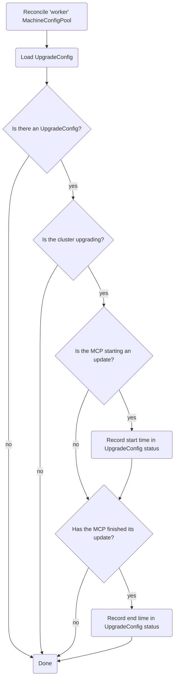

# MachineConfigPool controller

## About

The MachineConfigPool controller is used to monitor the state of worker `machineconfigpool`s in order to track the time at which they commence and complete upgrading.

These time metrics are recorded into the `UpgradeConfig`'s status history and used by MUO's metrics collector to report in upgrade metrics. The following is an example of the UpgradeConfig status history:

```
status:
  history:
  - phase: Upgraded
    workerCompleteTime: "2021-08-17T01:13:35Z"
    workerStartTime: "2021-08-17T00:44:50Z"
```

## How it works


