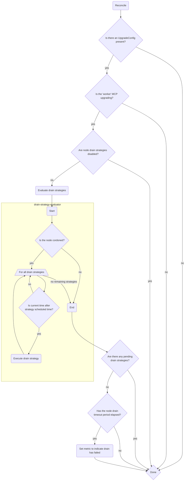

# Nodekeeper Controller

## About

The `managed-upgrade-operator` provides a mechanism for keeping track of upgrading worker nodes and seeks to ensure their timely and eventual upgrade.

The `Nodekeeper` controller makes sure that if an upgrading worker node is facing difficulty draining due to conditions such as [Pod Disruption Budgets](https://kubernetes.io/docs/concepts/workloads/pods/disruptions/#pod-disruption-budgets) or stuck finalizers, the `Nodekeeper` controller will perform strategies for draining the nodes properly and ensuring subsequent upgrade continuation.
The `Nodekeeper` controller will set the `upgradeoperator_node_drain_timeout` metric in Prometheus in the event that any worker node continues to unsuccessfully drain in spite of `NodeDrain` strategies.

## Inside the Nodekeeper Controller

- The `Nodekeeper` controller mechanism starts with setting the controller with `Add()` function which add sets up the controller for the operator manager - setting up a watch on the resource. For the `Nodekeeper` controller the mechanism is setting up a watch on the resource of `Node`.

- Now as already specified, the `Nodekeeper` controller works only towards the worker nodes, so for excluding the master nodes an [IgnoreMasterPredicate](https://github.com/openshift/managed-upgrade-operator/blob/master/pkg/controller/nodekeeper/ignoremaster_predicate.go) is used, which makes sure that the controller only targets worker nodes in it's mechanism.
The `IgnoreMasterPredicate` works on the basis of cache, so it considers all the nodes at first run and re-reconciles  at the next run and starts ignoring the Master nodes.

- The `Reconcile()` function is the main and most important part of the controller, it starts with creating `UpgradeConfigManager` to check if we are in an upgrading stage by specifically checking the `MachineConfig` through `IsUpgrading()` and also checks the history using `GetHistory()` based on the `UpgradeConfig` and get all the nodes from the `Kube-Client`. If the cluster is not detected as currently upgrading, the reconciler does not proceed further.

- For each reconciled node, the controller checks if it is cordoned using `IsNodeCordoned()`, which checks for `Unschedulable` and `Tainted` nodes (specifically for nodes with the `TaintEffectNoSchedule` taint). If the node is found to be cordoned, the controller performs a series of [drain strategies](##drain-strategies)  for the node and - if those strategies have failed to fix the node within a timeout period - sets the `upgradeoperator_node_drain_timeout` gauge metric. If however, the node is no longer cordoned, the reconciler assumes the drain and subsequent upgrade has succeeded, and so resets the metric.

## Drain strategies

The `NodeDrainStrategy` consists of:
- a set of predicates which define the conditions that a pod must be in in order to be considered for a node drain strategy; and
- a set of timed drain strategies, which perform the steps to address the detected conditions. The `timed` nature of the strategy means that the strategy is only initiated after a set period of time (measured from when the node was first detected as cordoned) has elapsed.

Following is the list of predicates used in this mechanism :
- `defaultOsdPodPrediate` : Used for any pod but not a `DaemonSet`.
- `isNotPdbPod` : If there's not a Pod Disruption Budget associated with the concerned pod.
- `isPdbPod` : If there's a Pod Disruption Budget associated with the concerned pod.

### Strategy: Pod Disruption Budgets (PDBs)
This strategy handles workloads which are disrupting a node drain due to [Pod Disruption Budgets](https://kubernetes.io/docs/concepts/workloads/pods/disruptions/#pod-disruption-budgets), which would be violated if the pod were to be evicted.

Pods which are protected by Pod Disruption Budgets are respected until the `pdbNodeDrainTimeout` period of the `UpgradeConfig` has elapsed. At that point, if a pod is still not draining due to the presence of a PDB, the pods will be forcefully deleted in order to progress the worker node drain.

### Strategy: Finalizers 
This strategy handles workloads which are disrupting a node drain due to a finalizer which may be preventing the pod from deleting. Pods are given until `NodeDrain.Timeout` to drain from the node before this strategy is considered. At that point, if a pod is still running on the node due to the presence of a finalizer, the finalizers will be removed from the Pod spec.

### Strategy: Stuck pods
This strategy handles workloads which are disrupting a node drain for any reason. Pods are given until `NodeDrain.Timeout` to drain from the node before this strategy is considered. At that point, if a pod is still running on the node, it is forcefully deleted.

### How to: disable drain strategy execution

Setting the `disableDrainStrategies` to `true` in the [MUO ConfigMap](../configmap.md) will prevent any drain strategies from executing.

### How to: prevent workloads from having drain strategies applied

Workloads can be prevented from having drain strategies applied to them through usage of the `ignoredNamespacePatterns` config in the [MUO ConfigMap](../configmap.md). Any workloads in namespaces matching the list of patterns will be excluded from consideration when applying drain strategies.

## How drain strategy execution time is calculated

Each drain strategy has its own calculated execution time.

All non-Pod Disruption Budget-related strategies use the `nodeDrain.timeOut` configuration from the [MUO ConfigMap](../configmap.md) to base the execution time off. This value (measured in minutes) is the amount of grace MUO is willing to give a node to fully drain before considering drain strategies.

```
   Strategy_Execution_Time = Time_Node_Commenced_Drain + Node_Drain_Timeout
```

PDB-related strategy execution times are calculated differently, as MUO allows for a configurable **Node Drain Grace Period** in the `UpgradeConfig`:

```
spec:
  PDBForceDrainTimeout: 60
```

The PDB-related strategy execution times use the `nodeDrain.expectedNodeDrainTime` configuration from the [MUO Configmap](../configmap.md) in conjunction with this value to calculate the execution time. The `expectedNodeDrainTime`, measured in minutes, is a "best case" estimate of how long MUO expects a node to take to drain.

```
   PDB_Strategy_Execution_Time = Time_Node_Commenced_Drain + 
                                 Expected_node_drain_time + 
                                 PDB_force_drain_timeout
```

### Known issue: drain strategy never executes?

If a node is flapping between being `Schedulable` and `Unschedulable`, it will cause the drain execution time to reset.

This is because the drain execution time is based upon the time that the node becomes `Unschedulable`. If the `Unschedulable` time resets (as in the case when a node flaps its cordoned state), then MUO will reset its drain execution time accordingly.

A node flapping like this is abnormal and hints towards a separate issue with that node that should be investigated further. Examination of the cluster's `machine-api-operator` or `machine-config-operator` controller rlogs may reveal more information about why the node is flapping in this state.

## How it works

The nodekeeper controller reconciles over `nodes` in the cluster.

It checks to see whether or not it should be attempting any drain strategy executions:

- Only if an UpgradeConfig is present indicating that the cluster is upgrading
- Only if a `worker` machineconfigpool is updating
- Only if drain strategies aren't disabled

If these checks are satisfied, it proceeds to iterate through all drain strategies. If a drain strategy can execute, meaning that:

- there exists a condition on the cluster that the drain strategy can fix
- the current time is past the drain strategy's execution time

then the drain strategy is executed.

Finally, the controller checks to see if there are any drain strategies which haven't yet executed. If there are none, and if the node drain timeout period has elapsed, then the node is considered a 'failed drain' and a metric is set to indicate this.


