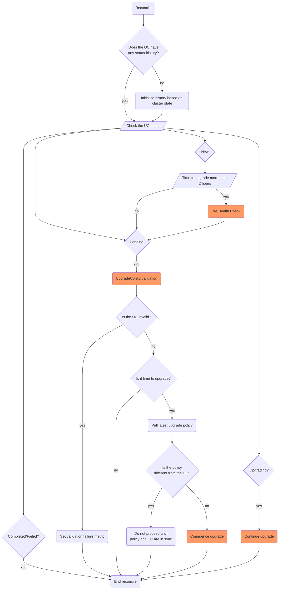
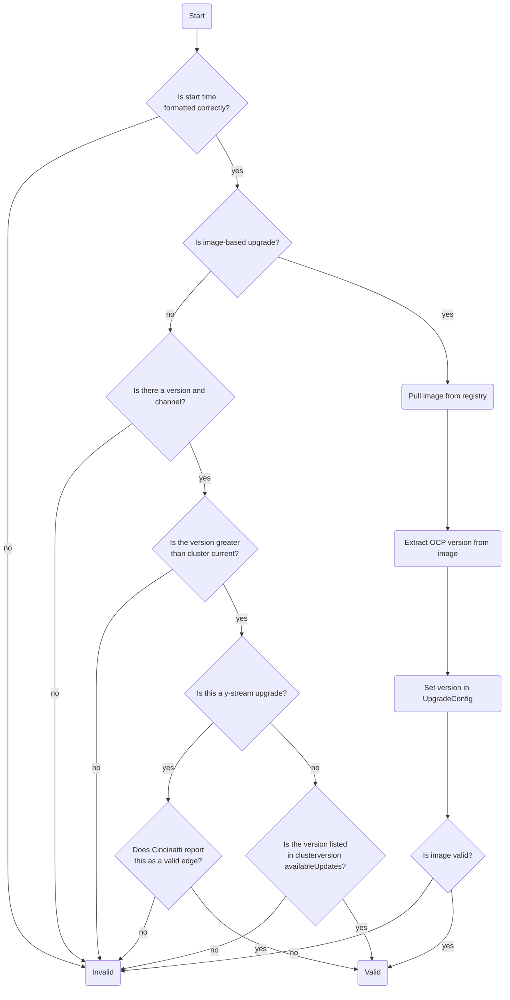
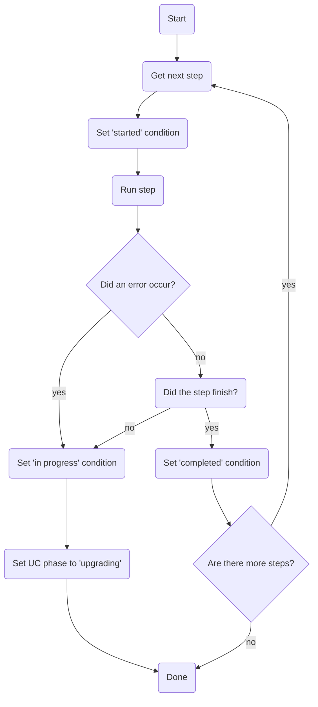
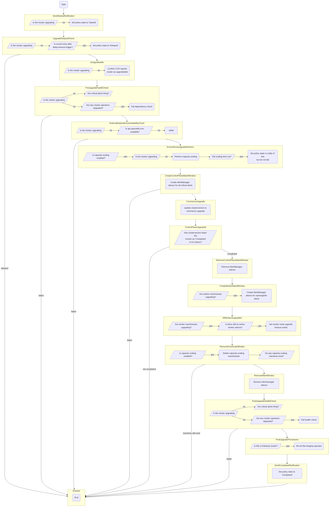

# UpgradeConfig controller

## About

The `UpgradeConfig` controller is the controller that drives the managed upgrade process.

This includes:

- Running of Pre-HealthCheck when an upgrade is scheduled in advance (> 2 hrs by default)
- Validation of the `Upgradeconfig`
- Initiating the upgrade process at the scheduled time
- Managing the upgrade process
- Recording the upgrade status

## How it works

The main reconcile loop is illustrated below.

Initially, it checks if the `UpgradeConfig` has a `status.history` set. The `status.history` records all history of the upgrade, including its current state, and the start/stop times for each phase of the upgrade. Example:

```
  status:
    history:
      phase: Upgrading
      startTime: "2021-08-16T23:30:58Z"
      version: 4.6.21
      workerCompleteTime: "2021-08-17T01:13:35Z"
      workerStartTime: "2021-08-17T00:44:50Z"
    - completeTime: "2021-08-17T01:16:29Z"
      conditions:
      - completeTime: "2021-08-16T23:33:04Z"
        lastProbeTime: "2021-08-17T01:16:25Z"
        lastTransitionTime: "2021-08-16T23:31:02Z"
        message: SendStartedNotification is completed
        reason: SendStartedNotification done
        startTime: "2021-08-16T23:30:58Z"
        status: "True"
        type: SendStartedNotification
      - # more conditions here...
```

If no history exists, one is initialized with a `phase` based upon the current state of the cluster (upgrading or not-upgrading).

The reconciler then checks the current phase of the `UpgradeConfig`.

If the phase is `New`:

- The time to upgrade is checked to decide if a Pre-HealthCheck is required to be run or not. This gives users/customers a notification in advance about what's wrong or can impact an upgrade and has time to address it when the upgrade actually starts at scheduled time.
- If the scheduled upgrade time is greater than the `HealthCheckDuration` time (defaults to 2 hours), then the Pre-HealthCheck is run. Else, the HealthCheck is run as per usual upgrade process as such just before the upgrade starts.
- Once the Pre-HealthCheck is run, the upgrade phase is set to "Pending" state.

If the phase is `Pending`:

- The `UpgradeConfig` contents are validated to ensure that the upgrade time is syntactically valid, and the version being upgraded to is a valid version.
- The upgrade start time is checked to see if the current time falls within the upgrade window (start time + the [ConfigMap's](../configmap.md) `upgradeWindow.timeOut` value).
- If it is now time to upgrade, MUO makes one last check with the upgrade policy provider to make sure that there aren't any last-minute changes of upgrade policy (ie. a cancellation of an upgrade since the last [provider sync](./upgradeconfigmanager.md).
- If the upgrade policy is in sync, the controller initiates the upgrade and sets the upgrade phase to `Upgrading`

If the phase is `Upgrading`:

- The controller executes the upgrade process.

If the phase is `Completed` or `Failed`:

- The controller does nothing. The `UpgradeConfig`'s eventual removal will be performed by the [UpgradeConfig Manager](./upgradeconfigmanager.md) when the policy provider reflects this change.



### UpgradeConfig validation

The `UpgradeConfig` validation process has two main forms of validation:

- If an [image-based](../design.md#configuration) upgrade is selected, MUO extracts the OCP version from that image and sets it in the `UpgradeConfig`, and validates the image metadata.
- If a [version-based](../design.md#configuration) upgrade is selected, MUO checks that:
  - For z-stream upgrades, the cluster's `clusterversion/version` must list the version in its `availableUpdates` status.
  - For y-stream upgrades, [cincinatti](https://api.openshift.com/?urls.primaryName=Upgrades%20information%20service) must list the version as an available edge to upgrade to.

The logic flow is as follows:



## Upgrade engine

The upgrade engine is what drives the various steps of the upgrade process.

The upgrade engine is designed around the approach of having an *ordered* list of *idempotent* steps.

Each time the upgrade engine [runs](../../pkg/upgradesteps/runner.go), it executes each step in order.

If a step indicates that it has either not completed (possibly because it takes time to do so), or has errored, then the upgrade engine does not proceed with the remaining steps until then next time it is invoked to attempt them. When it is next invoked, it will again start at the first step and work through them.

MUO has multiple implementations of the upgrade engine which provide their own composable series of upgrade steps, for example:

- [OSD](../../pkg/upgraders/osdupgrader.go)
- [ARO](../../pkg/upgraders/aroupgrader.go)

MUO [decides](../../pkg/upgraders/builder.go) which upgrader to use based upon the `upgradeType` [configuration](../design.md#configuration).

The upgrader may also choose to implement other specific handling outside of executing the steps. For example, the OSD upgrader will check if a cluster upgrade needs to be cancelled and failed for not starting within the upgrade window.



### Writing upgrade steps

An important design criteria must be met when maintaining or introducing new upgrade steps, which is idempotency.

If the step has brought the cluster into the state it needs to be in, then executing the step a second time should result in no changes.

The step function needs to be added to the `clusterUpgrader` struct, as in the following example:

```
func (c *clusterUpgrader) MyStep(ctx context.Context, logger logr.Logger) (bool, error) {
    // code here
}
```

- If the step has successfully executed and brought the cluster into the desired state, then it should return `true` and no error.

- If the step must wait some period of time to finish, it should *not* sleep or loop indefinitely in the function waiting for that condition to be satisfied. Rather, it should return `false` and no error. MUO will try it again on its next reconcile.

- If an error occurs, it should return `false` and the error.

To integrate your step into the upgrader process, you should:

- Define a [condition name](../../api/v1alpha1/upgradeconfig_types.go) constant if you want the step to be reported in the `UpgradeConfig` conditions, and if [metrics](../../pkg/collector/collector.go) on it should be collected.

- Add it to the `steps` of whichever upgrader should run it, ie the [OSD upgrader](../../pkg/upgraders/osdupgrader.go), in the specific position order that it should be executed as part of the upgrade process.

### OSD Upgrader

The following flow describes the order and process of the [OSD Upgrader](../../pkg/upgraders/osdupgrader.go).


