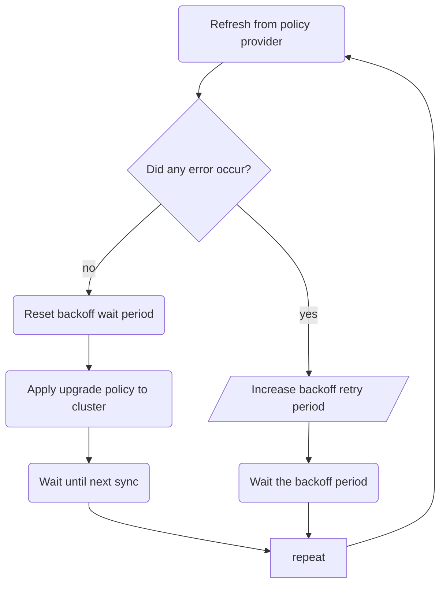
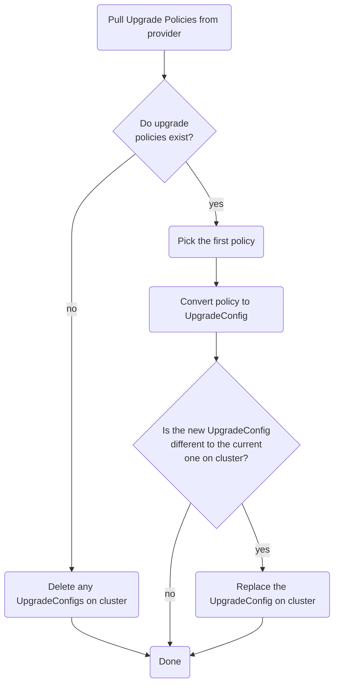

# UpgradeConfigManager

## About

The `UpgradeConfig Manager`` (UCM) is not a controller, and does not reconcile over any cluster resources. It runs as a separately executing goroutine alongside the other controllers.

The UCM's job is to sync with a provider of cluster upgrade policies, and translate the upgrade policy (if existing) into an `UpgradeConfig` resource on the cluster.

## How it works (at a high level)

The UCM periodically syncs with a policy provider.

The period in which it syncs is defined by the [configManager](../configmanager.md) section of the MUO ConfigMap.

If the UCM encounters an error syncing with the provider, it performs an incremental backoff wait before trying again. This is to avoid overwhelming the provider with frequent, repeated retries.

If the UCM syncs with the policy provider successfully, the upgrade policy (if existing) is applied to the cluster in the form of an `UpgradeConfig` resource.

### Upgrade policy providers

There are two types of upgrade policy provider currently implemented.

#### OCM policy provider

The OCM Policy provider queries the [OCM Cluster Service API](https://api.openshift.com/#/default/get_api_clusters_mgmt_v1_clusters__cluster_id__control_plane_upgrade_policies) for any active cluster upgrade policies.

To be considered, an upgrade policy must NOT be in a state of either `pending` (meaning it is not scheduled), `completed` (meaning it has finished) or `cancelled` (meaning it should not execute).

Authentication to the Cluster Service API is performed using the cluster's `cloud.openshift.com` pull secret. This is retrieved by MUO from the `openshift-config/pull-secret` Secret.

#### Local policy provider

The Local policy provider is essentially a no-op provider that treats a local `UpgradeConfig` custom resource as the "provider" of the cluster's upgrade policy. It translates the on-cluster `UpgradeConfig`, if any, into an upgrade policy, which in turn would be translated back into an `UpgradeConfig` (with no change).

This method is to be used if you want to upgrade a cluster by just creating an `UpgradeConfig` CR.

### How it works: policy provider refresh

The policy provider refresh works by pulling the upgrade policies from the provider, then considering the first (currently, only one policy may exist per cluster in OCM).

If no policies exist, then any `UpgradeConfig` currently on-cluster is deleted, as it does not reflect the state of the policy provider (the provider is always treated as the source of truth).

If a policy exists, it is transformed into an `UpgradeConfig`.

If there is any existing `UpgradeConfig` on the cluster, it is loaded, and then compared against the proposed "new" policy. If the two differ, the `UpgradeConfig` on cluster is replaced with the one retrieved from the policy provider.

