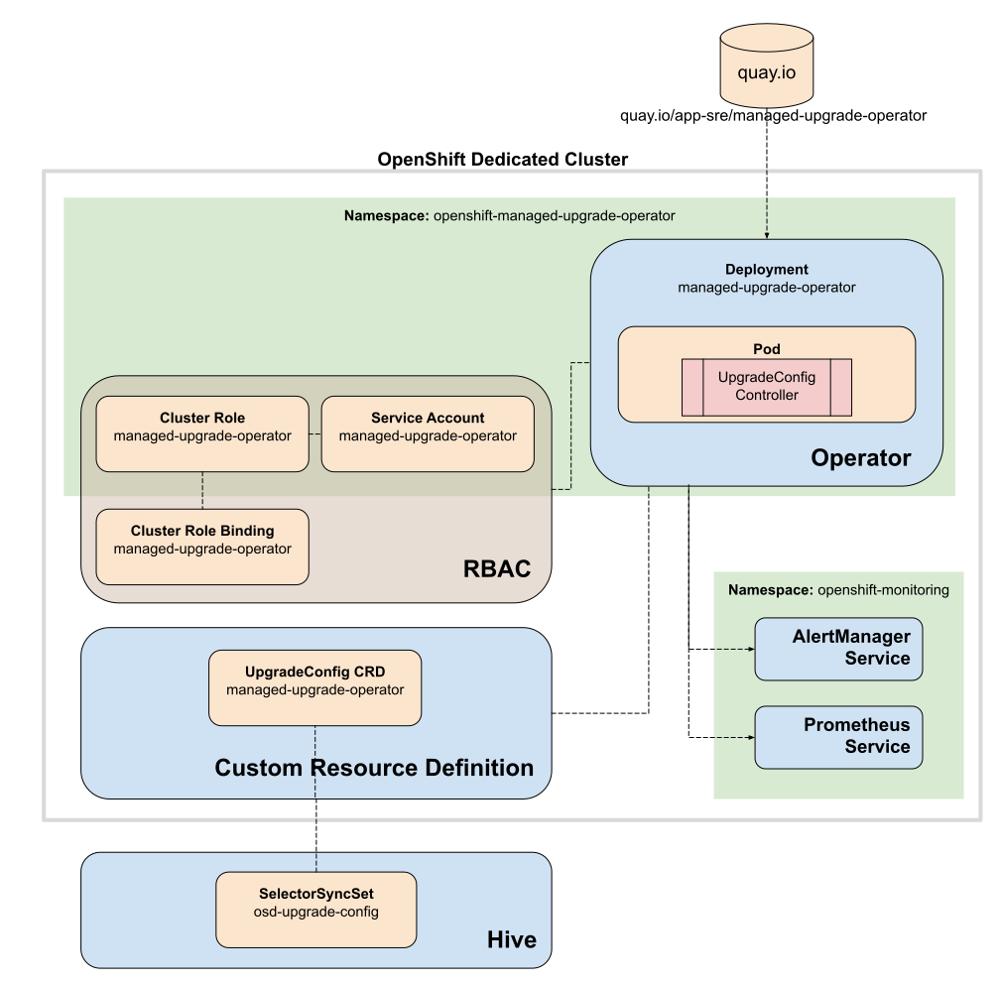
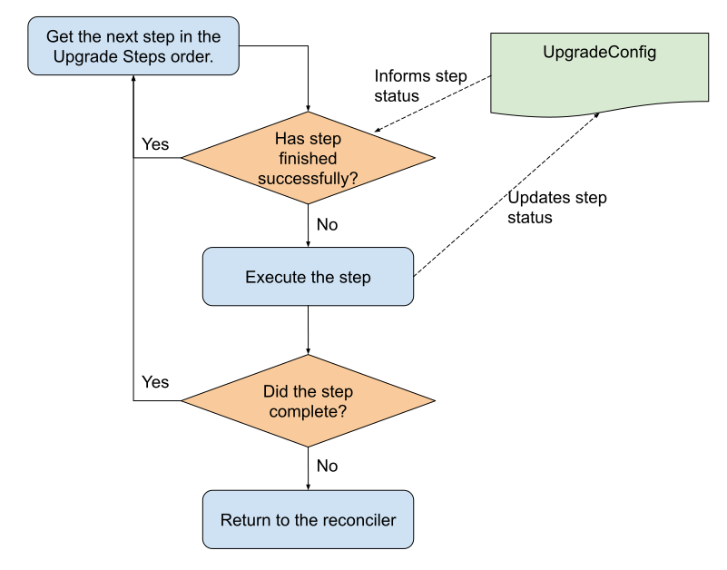

# Design

## Resources and components

This document describes the design of the Managed Upgrade Operator and the resources it uses.

The following diagram illustrates the main resources that the Managed Upgrade Operator interacts with.  



The operator is primarily driven through an `UpgradeConfig` custom resource, which defines the version of OpenShift that the cluster should be running at.

The `UpgradeConfig` can be created directly on the cluster which is not managed via Hive. Also this method can be used for development/testing purposes

For OpenShift Dedicated deployments, the `UpgradeConfig` is distributed via a [Hive SelectorSyncSet](https://github.com/openshift/hive/blob/master/docs/syncset.md) and managed by OpenShift SRE.

The process for SRE to manage the creation and distribution of `UpgradeConfig` custom resources is documented in [SOPs](https://github.com/openshift/ops-sop/blob/master/v4/howto/managed-upgrade.md).

## Custom Resource Definitions

### UpgradeConfig

#### Configuration

The `UpgradeConfig` Custom Resource Definition (CRD) defines the version of OpenShift Container Platform that the cluster should be upgraded to, when conditions allow.

For the purpose of upgrading a cluster, an `UpgradeConfig` resource _must_ be configured with the following properties:

| Item | Definition | Example |
| ---- | ---------- | ------- |
| `type` | The cluster upgrader to use when upgrading (valid values: `OSD`, `ARO`)| `OSD` |  
| `upgradeAt` | Timestamp indicating when the upgrade can commence (ISO-8601)| `2020-05-01T12:00:00Z` |
| `PDBForceDrainTimeout` | Duration in minutes that a PDB-blocked node is allowed to drain before a drain is forced | `120` |
| `desired.version` | The desired OCP release to upgrade to | `4.4.6` |
| `desired.channel` | The [channel](https://github.com/openshift/cincinnati/blob/master/docs/design/openshift.md#Channels) the Cluster Version Operator should be using to validate update versions | `fast-4.4` |
| `capacityReservation` | If extra worker node(s) are needed during the upgrade to hold the customer workload | `true` |

A populated `UpgradeConfig` example is presented below:

```yaml
apiVersion: upgrade.managed.openshift.io/v1alpha1
kind: UpgradeConfig
metadata:
  name: example-upgrade-config
spec:
  type: "OSD"
  upgradeAt: "2020-06-20T12:00:00Z"
  PDBForceDrainTimeout: 120
  capacityReservation: true
  desired:
    channel: "fast-4.4"
    version: "4.4.6"
```

The CRD is available to [view in the repository](../deploy/crds/upgrade.managed.openshift.io_upgradeconfigs_crd.yaml).

#### Status

The Managed Upgrade Operator will record the history of its efforts to apply the desired upgrade within the `UpgradeConfig`'s `status` section. Data within this section can be used to determine the operator's progress to apply the upgrade.

At the top level, the following fields are defined in a list, each list element representing a unique cluster version:

| Item | Definition | Example |
| ---- | ---------- | ------- |
| `version` | The cluster version that the operator events related to | `4.4.6` |
| `startTime` | The ISO-8601 timestamp at which the upgrade commenced. | `2020-07-05T01:35:36Z` |
| `completeTime` | The ISO-8601 timestamp at which the upgrade completed. | `2020-07-05T01:35:36Z` |
| `phase` | The current phase of the upgrade's application | `New`, `Pending`, `Upgrading`, `Upgraded`, `Failed`, `Unknown` |
| `conditions` | Data pertaining to a particular upgrade step that the operator performs | - |

Within `conditions`, each upgrade step can record its own individual status. These conditions are similar to [Pod conditions](https://kubernetes.io/docs/concepts/workloads/pods/pod-lifecycle/), but relate to upgrade steps.

| Item | Definition | Example |
| ---- | ---------- | ------- |
| `type` | The type of upgrade step being performed | `PreHealthCheck` |
| `startTime` | The ISO-8601 timestamp at which the step commenced. | `2020-07-05T01:35:36Z` |
| `completeTime` | The ISO-8601 timestamp at which the step completed. | `2020-07-05T01:35:36Z` |
| `lastProbeTime` | The last time this step's condition was last probed | `2020-07-05T01:35:36Z` |
| `lastTransitionTime` | The last time this step transitioend from one status to another | `2020-07-05T01:35:36Z` |
| `message` | Human-readable details indicating details about the transition | `PreHealthCheck succeed` |
| `reason` | Human-readable details about why the transition has occurred | `Cluster has critical alerts` |
| `status` | Status of the condition | `True`, `False`, `Unknown` |

A fully-populated example of an `UpgradeConfig` status is included below:

```yaml
  status:
    history:
    - phase: Upgraded
      version: 4.3.26              
      startTime: "2020-07-05T01:35:36Z"      
      completeTime: "2020-07-05T03:15:37Z"                                                     
      conditions:            
      - completeTime: "2020-07-05T03:15:36Z"
        lastProbeTime: "2020-07-05T03:15:36Z"
        lastTransitionTime: "2020-07-05T03:15:36Z"                                             
        message: ScaleUpExtraNodes succeed                                                     
        reason: ScaleUpExtraNodes succeed  
        startTime: "2020-07-05T03:15:36Z"
        status: "True"                   
        type: ScaleUpExtraNodes
      - completeTime: "2020-07-05T03:15:36Z"
        lastProbeTime: "2020-07-05T03:15:36Z"
        lastTransitionTime: "2020-07-05T03:15:36Z"                                             
        message: PreHealthCheck succeed                                                        
        reason: PreHealthCheck succeed                                                         
        startTime: "2020-07-05T03:15:36Z"                                                      
        status: "True"                   
        type: PreHealthCheck
```

## Config Managers

The `managed-upgrade-operator` provides a configurable mechanism for retrieving and storing an `UpgradeConfig`
Custom Resource that can be reconciled against by the `UpgradeConfig` controller.

For more information, see the dedicated section on this topic: [UpgradeConfig Managers](configmanager.md)

## Controllers

The `managed upgrade operator` provided upgrade process revolves around multiple Controllers. Alongside the above mentioned `UpgradeConfig` controller, the `NodeKeeper` controller works simultaneously in an upgrade process towards the state of nodes in the cluster.

The `NodeKeeper` controller keeps a track of the upgrading worker nodes during an upgrade and seeks to ensure their timely and eventual upgrade.

If an upgrading worker node is experiencing difficulty draining due to conditions such as [Pod Disruption Budgets](https://kubernetes.io/docs/concepts/workloads/pods/disruptions/#pod-disruption-budgets) or stuck finalizers, the `NodeKeeper` controller will perform remediation strategies to ensure the node's eventual drain and subsequent upgrade continuation.
The `NodeKeeper` controller will flag through metrics any worker node that continue to unsuccessfully drain in spite of the remediation strategies.

## Upgrade Process

### Cluster Upgrader

The steps performed by the Managed Upgrade Operator are carried out by implementations of the [ClusterUpgrader](../pkg/osd_cluster_upgrader/upgrader.go) interface.

Each `ClusterUpgrader` implementation must define an ordered series of `UpgradeSteps`, which represents the runbook of the implementation when conducting a cluster upgrade.

`UpgradeStep`s are homogeneous functions of code that carry out a part of the upgrade process. If the step has completed, it will return `true`. If the step has not completed, it will return `false`. If the step has failed, it will return an error.

When actively performing a cluster upgrade, the operator will follow the process below during each iteration of the controller reconcile loop:
- Get the first step in the ordered list.
- Check if the `UpgradeConfig`'s status history indicates the step has already completed.
  - If the step has already completed, move to the step.
- If the step has not already completed, execute the step.
  - If the step returns `true` indicating it has successfully completed, move to the next step.
  - If the step returns `false` indicating it has not successfully completed, the operator will check again on the next reconcile loop.
  - If the step returns an error, the operator will log this, and try to execute the step again on the next reconcile loop.

Steps should generally be idempotent in nature; if they have already run and completed during an upgrade, they should return `true` for subsequent calls and not attempt to re-perform the same action. An example of this is the `ControlPlaneMaintWindow` step to create a maintenance window.

This overall process of executing Upgrade Steps is illustrated below.



To define a new custom procedure for performing a cluster upgrade, a developer should:
- Create a new implementation of the `ClusterUpgrader` that defines a unique order of `UpgradeStep`s.
- Implement any missing or new `UpgradeStep`s that need to be performed.  

### Ready to upgrade criteria

The Managed Upgrade Operator will only attempt to perform an upgrade if the current system time is later than,
but within _30 minutes_ of, the `upgradeAt` timestamp specified in the `UpgradeConfig` CR.

For example:

| `upgradeAt` time | Current time | Commence Upgrade? |
| --- | --- | --- |
| `2020-05-01 12:00:00` | `2020-05-01 11:50:00` | No, it is not yet 12:00 |
| `2020-05-01 12:00:00` | `2020-05-01 12:32:00` | No, 30 minutes have passed since 12:00 |
| `2020-05-01 12:00:00` | `2020-05-01 12:15:00` | Yes, it is within the upgrade window |

### Validating upgrade versions

The following checks are made against the desired version in the `UpgradeConfig` to assert that it is a valid version to upgrade to.

* The version to upgrade to is greater than the currently-installed version (rollbacks are not supported)
* The [Cluster Version Operator](https://github.com/openshift/cluster-version-operator) reports it as an available version to upgrade to.
